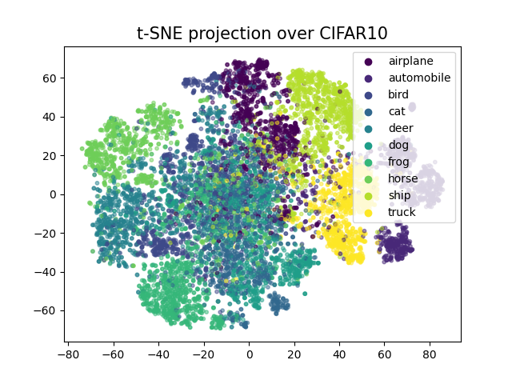
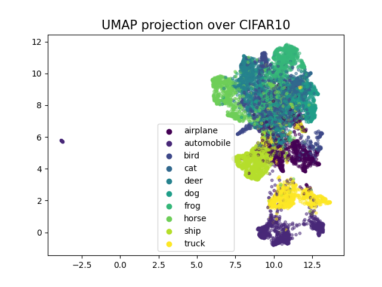

# SSL_Playground

This project focuses on practicing **Self-Supervised Learning (SSL)** using the NVIDIA Data Loading Library (DALI) and analyzing embeddings. We used ResNet50 as the base encoder and followed the SSL method introduced in [SimCLR](https://arxiv.org/pdf/2002.05709). The encoder was trained with SSL on the CIFAR-10 dataset, and the resulting embedding vectors were analyzed using dimensionality reduction techniques such as t-SNE and UMAP. We also evaluated the accuracy of the SSL model.

## Key words:   
* SSL (Self-supervised Learning)
* [DALI](https://docs.nvidia.com/deeplearning/dali/user-guide/docs/index.html) (NVIDIA Data loading Library)
* [t-SNE](https://scikit-learn.org/stable/modules/generated/sklearn.manifold.TSNE) (t-Distributed Stochastic Neighbor Embedding)
* [UMAP](https://umap-learn.readthedocs.io/en/latest/) (Uniform Manifold Approximation and Projection)
* DDP (Data Distributed Parallel)

## Implementation Details
* Dataset : CIFAR 10
* Test Acc : 87% 
* Batch size : 256
* GPUs : 8 * GTX3090
* Epochs : 2000 (Elasped Time 15 Hours)
* Augmentation : Resized Crop + Horizontal Flip + Color Jitter 
* Loss : InfoNCE Loss with temperature 0.5
* optimizer : Adam. Learning rate 0.03
* scheduler : CosineAnnealingLR with T_max=50

## Visualizations

